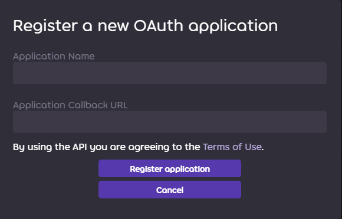
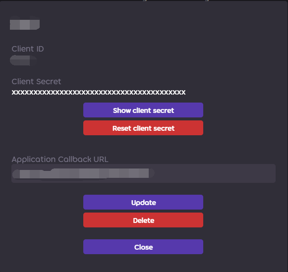

# OsuMapSuggester

A [mirai-console](https://github.com/mamoe/mirai-console) plugin that can provide **osu!std** players some appropriate beatmap. (WIP)

[](https://github.com/StageGuard/OsuMapSuggester/actions/workflows/build.yml) [](https://www.codefactor.io/repository/github/stageguard/osumapsuggester/overview/main)

## Features

It can analyze player's **aim**, **speed** and **accuracy** skills of his best performances and [PerformancePlus](https://syrin.me/pp+/) and other factors to infer what type of the player he is.

Then it can recommend specific beatmap for his shortcomings or other kind of beatmap.

**But currently none of the feature above is implemented, because it is still working in progress. XD**

There are other features: 

- [ ] Analyze player's skills(main function).
- [ ] Recommend specific beatmap(main function).
- [x] Show your best performance picture.
- [x] Best performance versus.
- [x] Recalculate the best performance if all full combo.
- [ ] ...

## How plugin process OAuth request and bind account

When users click OAuth link and confirm authorization. It will redirect to your callback URL with query parameters `state` and `code`. 

The OsuMapSuggester plugin will open a frontend http server to process the parameters.

## Deploy

It is easy to deploy this bot.

#### Preparation: 

- A **MySQL** or **MariaDB** database, create a database for this plugin.

- A server with public IP.

- <details> <summary>Mirai console runtime environment.</summary>
      Learn how to setup mirai console: <a href="https://github.com/mamoe/mirai/blob/dev/docs/UserManual.md">https://github.com/mamoe/mirai/blob/dev/docs/UserManual.md</a>
  </details>

- <details> <summary>osu! OAuth Application</summary>
		1. Go to <a href="https://osu.ppy.sh/home/account/edit">https://osu.ppy.sh/home/account/edit</a><br><br>
      2. Click <b>New OAuth Application</b><br>
      <br><br>
      3. Set <b>Application Callback URL</b> to <b>http://&lt;your server ip or domain name&gt;:port/authCallback</b><br>
      <br><br>
      4. Copy <b>Client Id</b> and <b>Client Secret</b>.<br>
      
  </details>
  
- <details> <summary>osu! v1 api key</summary>
      Request a new v1 api key: <a href="https://osu.ppy.sh/p/api/">https://osu.ppy.sh/p/api/</a>
  </details>

#### Run: 

1. Clone this project and open with IntelliJ IDEA. Sync gradle project and run `mirai/buildPlugin` task to build the plugin binary file.

> You can also build via command line by running `chmod +x gradlew && ./gradlew buildPlugin` command if your IntelliJ IDEA is not installed. The output binary file is in `build/mirai`.

2. Copy the output in `build/mirai/OsuMapSuggester-xxx.mirai.jar` to `<console runtime>/plugins/` folder, and start mirai console once, you may get this error log: 

```
2021-07-26 20:22:37 E/OsuMapSuggester: Failed to connect database: com.zaxxer.hikari.pool.HikariPool$PoolInitializationException: Failed to initialize pool: Access denied for user 'root'@'localhost' (using password: YES).
2021-07-26 20:22:37 E/OsuMapSuggester: Retry to connect database in 10 seconds.
```

3. Close mirai console, edit `config/OsuMapSuggester/OsuMapSuggester.Config.yml`

```yaml
qq: 1234567890 # Enable the plugin for this bot
database: 
  address: localhost # Your database address
  port: 3306 # Database port
  user: root # Database user
  password: testpwd # Database password
  table: osu!beatmap suggester # Database name
  maximumPoolSize: 10
osuAuth: 
  clientId: 0 # The OAuth application client id you just created.
  secret: '' # OAuth application client secret
  authCallbackBaseUrl: 'http://localhost:8081' # callback base url, it is for generating OAuth link when users bind qq account, must be same with OAuth application callback base url(no "/authCallback").
  v1ApiKey: '' # your v1 api key
frontend: # frontend is used to process oauth application callback
  host: localhost # frontend host
  port: 8081 # frontend port
```

4. Save config, rerun mirai console. If you see this log, it means everything works ok.

```
2021-07-26 20:34:27 I/OsuMapSuggester: Subscribed group and friend messages.
```

## Issues

This project is still working in progress, it is unstable and there are still many bugs.

If you suffer from fatal bug when running bot, please open an issue with `bug` to feedback.

Also, if you have any good idea, welcome to contribute to this project or open an issue with `feature` label.

## Library

- Mirai Framework: [mirai](https://github.com/mamoe/mirai/), [mirai-console](https://github.com/mamoe/mirai-console), [mirai-slf4j-bridge](https://github.com/project-mirai/mirai-slf4j-bridge)
- Database: [Ktorm](https://github.com/kotlin-orm/ktorm), [HikariCP](https://github.com/brettwooldridge/HikariCP)
- Web Server: [ktor](https://github.com/ktorio/ktor)
- Graphics: [skija](https://github.com/JetBrains/skija)
- osu! Related: [peace-performance](https://github.com/Pure-Peace/peace-performance), [pp+ algorithm](https://github.com/Syriiin/osu), [osuReplayAnalyzer](https://github.com/firedigger/osuReplayAnalyzer)
- Utilities: apache utilities(commons-io, commons-math3, commons-compress), [xz](https://tukaani.org/xz/java.html)

## LICENSE of this project and mirai

```
OsuMapSuggester
Copyright (C) 2021 StageGuard

This program is free software: you can redistribute it and/or modify
it under the terms of the GNU Affero General Public License as published
by the Free Software Foundation, either version 3 of the License, or
(at your option) any later version.

This program is distributed in the hope that it will be useful,
but WITHOUT ANY WARRANTY; without even the implied warranty of
MERCHANTABILITY or FITNESS FOR A PARTICULAR PURPOSE.  See the
GNU Affero General Public License for more details.

You should have received a copy of the GNU Affero General Public License
along with this program.  If not, see <https://www.gnu.org/licenses/>.
```

```
mirai
Copyright (C) 2019-2021 Mamoe Technologies and contributors.

This program is free software: you can redistribute it and/or modify
it under the terms of the GNU Affero General Public License as
published by the Free Software Foundation, either version 3 of the
License, or (at your option) any later version.

This program is distributed in the hope that it will be useful,
but WITHOUT ANY WARRANTY; without even the implied warranty of
MERCHANTABILITY or FITNESS FOR A PARTICULAR PURPOSE.  See the
GNU Affero General Public License for more details.

You should have received a copy of the GNU Affero General Public License
along with this program.  If not, see <http://www.gnu.org/licenses/>.
```
